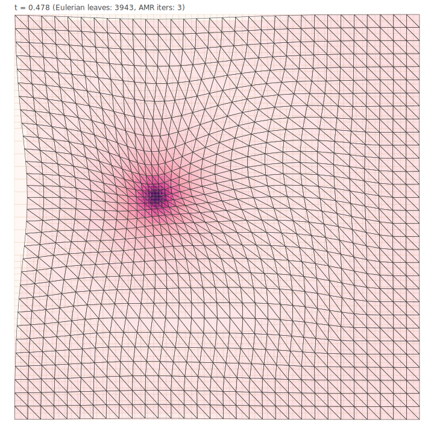

# LagrangianPixelization

A visual mini-app demonstrating HierarchicalGrids.jl on a 2D
Lagrangian-to-Eulerian pixelization problem with adaptive refinement
and physical density visualization.



*(figure auto-generated by `examples/swirl.jl` — see "Quick start" below)*

## What it shows

A 2D Lagrangian triangle mesh (initially uniform on the unit square)
is deformed by a time-dependent flow map. An adaptive Eulerian quadtree
refines its leaves so that **each deformed Lagrangian triangle is
overlapped by approximately the same number of Eulerian leaves** —
small triangles get fine cells, large triangles get coarse cells.

Each Lagrangian simplex carries a fixed mass equal to its reference
area (the "uniform mass per reference area" assumption from cosmological
dark-matter sheet tessellations or any incompressible Lagrangian flow).
When the flow compresses a simplex, density goes up; when it stretches,
density goes down. The mass is deposited onto the Eulerian leaves
through the geometric overlap computed by the framework's
r3djl-backed `compute_overlap`, giving a physical density per Eulerian
cell. The cells are colored by that density.

The headline result: compressed regions show up bright (deep magenta
in the RdPu palette) AND get finely refined by the AMR — exactly the
behavior you'd want from an adaptive Lagrangian↔Eulerian pipeline.

## What it exercises in HierarchicalGrids.jl

| API surface                          | How this demo uses it                    |
| ------------------------------------ | ---------------------------------------- |
| `SimplicialMesh{2, Float64}`         | The Lagrangian triangulation             |
| `set_vertex_position!`               | Advancing vertices under the flow map    |
| `simplex_volume` / `simplex_reference_volume` | Computing density factors               |
| `HierarchicalMesh{2}`                | The Eulerian quadtree                    |
| `EulerianFrame{2, Float64}`          | Physical-coordinate wrapper              |
| `compute_overlap`                    | Exact 2D triangle ∩ box clipping         |
| `entries_for_lag` / `entries_for_eul`| Per-simplex / per-leaf overlap queries   |
| `refine_by_indicator!`               | The AMR loop                             |
| `total_overlap_volume`               | Mass-conservation diagnostic             |

## Quick start

From this directory:

```bash
julia --project=. -e 'using Pkg; Pkg.develop(path="../.."); Pkg.instantiate()'
julia --project=. examples/swirl.jl                           # 24-frame headline demo
julia --project=. examples/rotation.jl                        # rigid rotation control
```

The first run takes ~10 s for precompilation, then ~10 s for the
swirl sequence (24 frames at 32×32 Lagrangian resolution).

Frames are written to `frames/swirl/frame_NNNN.svg` and
`frames/rotation/frame_NNNN.svg`. Each is a self-contained vector
graphic that opens in any browser, drops cleanly into LaTeX, and can
be converted to a raster sequence for animation.

## Assembling a GIF or video

The frames are vector SVG. To make a GIF:

```bash
# With ImageMagick (renders SVGs internally):
magick -delay 8 frames/swirl/frame_*.svg out.gif

# Or with rsvg-convert + ffmpeg (better quality for video):
for f in frames/swirl/frame_*.svg; do
    rsvg-convert -w 720 "$f" -o "${f%.svg}.png"
done
ffmpeg -framerate 12 -pattern_type glob \
       -i 'frames/swirl/frame_*.png' \
       -c:v libx264 -pix_fmt yuv420p out.mp4
```

To render a single frame as a PNG with the `cairosvg` Python module:

```bash
pip install cairosvg
python3 -c "
import cairosvg
cairosvg.svg2png(url='frames/swirl/frame_0012.svg',
                 write_to='peak.png',
                 output_width=720, output_height=720)"
```

## The flow maps

Five flow maps are provided plus a composition primitive:

| Map                 | Properties                                      |
| ------------------- | ----------------------------------------------- |
| `IdentityMap()`     | No deformation; sanity check                    |
| `RigidRotation(ω)`  | Linear rigid rotation; preserves areas          |
| `SwirlMap(...)`     | Radial twist; near-area-preserving              |
| `TaylorGreenPulse(...)` | Pulsating shear; incompressible to first order |
| `GaussianCompression(...)` | Compression toward an off-center point; **non-area-preserving** |
| `CustomMap(f)`      | Wraps a user closure `(x, y, t) -> (x', y')`    |

`ComposedMap(first, second)` chains two maps in order. The headline
demo composes `SwirlMap` with `GaussianCompression` to get both shear
and density variation.

## The AMR criterion

For each Eulerian leaf `i`, the indicator value is

    indicator[i] = max over Lagrangian simplices s overlapping i of
                   max(0, target - n_eulerian_leaves_overlapping(s))

Refine when `indicator > 0.5`. This is a **high-water-mark** trigger:
an Eulerian leaf is refined if *any* covered Lagrangian simplex has
fewer than `target` overlapping leaves. The loop iterates until no
leaf has a positive indicator. Coarsening is disabled in this demo
(the mesh is rebuilt fresh per frame).

The indicator is purely topological — it doesn't depend on densities,
deformation gradients, or any field data. That's deliberate: it
demonstrates that the framework's AMR machinery does the right thing
from a simple count-based criterion.

## Density visualization

`run_sequence!` colors Eulerian cells by mass density (default).
Density is computed as

    ρ_eulerian[i] = (deposited mass[i]) / (Eulerian cell area[i])

where mass is deposited via the geometric overlap:

    mass[i] = Σ over (s, i) overlaps of (V_ref(s) / V_now(s)) · V_overlap

The factor `V_ref(s) / V_now(s)` is the per-simplex density (mass
conservation: a simplex with reference area `A_ref` carries mass `A_ref`,
and after deformation its area is `A_now`, so its density is
`A_ref / A_now`). Each overlap entry deposits `V_overlap` worth of area
multiplied by that density.

For consistent coloring across frames, pass a `density_range = (lo, hi)`
to `run_sequence!`. For pure topology (overlap counts), pass
`color_by = :overlap_count`. For no fill, `color_by = :none`.

## Three palettes

| Symbol             | Range                                         |
| ------------------ | --------------------------------------------- |
| `:rd_pu`           | Light pink → magenta → deep purple (default for density) |
| `:grayscale_warm`  | Light grey → warm orange-red                  |
| `:viridis_lite`    | Purple → blue → green → yellow                |

Set via `SvgStyle(count_color_palette = :rd_pu)`.

## Architecture

```
src/
├── LagrangianPixelization.jl     entry module, re-exports
├── flow_maps.jl                   FlowMap subtypes + ComposedMap, ∘ operator
├── lag_mesh.jl                    build_unit_square_lag_mesh,
│                                   advance_lagrangian!
├── pixelize.jl                    PixelizationParams, pixelize! (AMR loop),
│                                   per-simplex/per-leaf counters,
│                                   lagrangian_density_factors,
│                                   eulerian_density (mass deposition)
├── plotting.jl                    Standalone SVG writer; three color palettes;
│                                   per-cell-value coloring (density mode)
└── simulation.jl                  Simulation, step_to_time!,
                                    run_sequence! with color_by + density_range

examples/
├── swirl.jl                       Headline demo: SwirlMap ∘ GaussianCompression,
│                                   density coloring, RdPu palette
└── rotation.jl                    Control case: rigid rotation, uniform AMR

test/runtests.jl                   564 tests covering flow maps, mesh
                                    construction, AMR convergence, mass
                                    conservation, density correlation
                                    with AMR depth, SVG output
```

## Choosing parameters

The defaults in `examples/swirl.jl` are tuned for visual clarity:

- `n_per_axis = 32` → 32×32 vertices, ~1900 triangles. Goes from
  visually choppy (`= 8`) to very dense (`= 64+`).
- `eul_initial_depth = 5` (32×32 starting grid). If much smaller
  than the Lagrangian mesh, the AMR refines uniformly first; the
  interesting variation appears when starting at the same scale.
- `flow_map = ComposedMap(SwirlMap(strength=2.0), GaussianCompression(amplitude=0.6, ...))`.
  The swirl strength is right at the inversion-free boundary for
  this density. The compression amplitude controls the peak density
  contrast — `0.6` gives ~6× compression at the center.
- `target_eul_per_lag = 4`. Higher values give a finer pixelization
  at the cost of more leaves; lower values may produce uniformly
  coarse output where the AMR has no signal.
- `density_range = (0.5, 6.0)`. Fixes the colormap across all frames
  for a stable animation. Skip to auto-find a per-sequence range.

## Adding your own flow map

Subclass `FlowMap` and implement `apply_map`:

```julia
struct MyMap <: FlowMap
    a::Float64
end

LagrangianPixelization.apply_map(m::MyMap, x, y, t) =
    (x + m.a * sin(2π*t) * y,
     y + m.a * cos(2π*t) * x)

sim = Simulation(; flow_map = MyMap(0.1))
```

For one-off experiments, wrap a closure with `CustomMap`:

```julia
sim = Simulation(;
    flow_map = CustomMap((x, y, t) -> (x + 0.1*sin(t), y + 0.1*cos(t))),
)
```

Or compose existing maps:

```julia
sim = Simulation(;
    flow_map = SwirlMap(strength=1.5) ∘ GaussianCompression(amplitude=0.4),
)
```

(The `∘` operator follows function-composition order: `g ∘ f` applies
`f` first, then `g`.)
